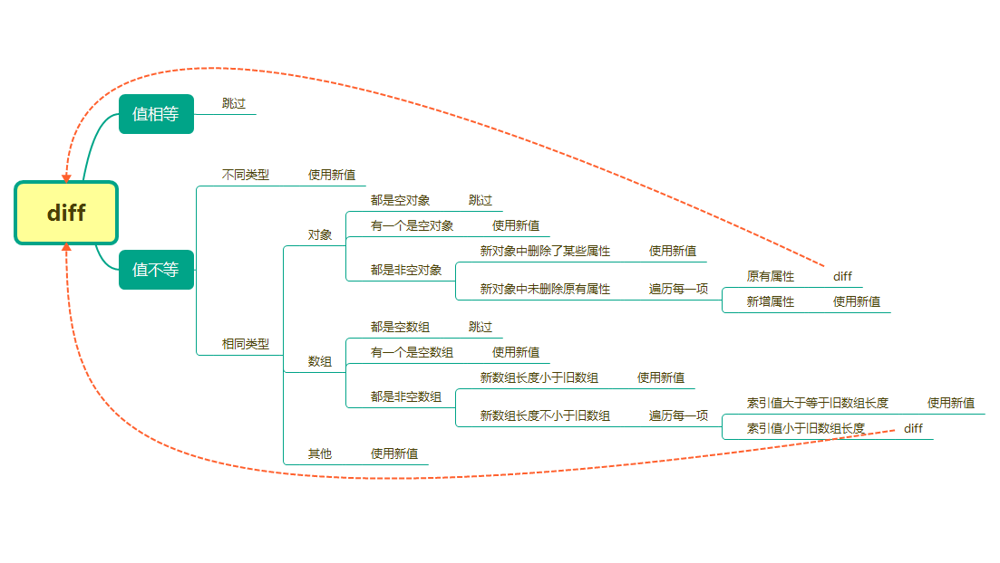

# mpext

> 对原生小程序开发进行简单的扩展封装

## 特性

- 可直接使用`Redux`作为全局状态管理，触发更新后，未销毁的页面（组件）内状态自动更新
- 对`setData`的数据进行`diff`优化
- 支持`mixin`混入

### 使用`Redux`

- 创建`store`

`mpext`本身并不包含`Redux`，需单独引用

```js
import { combineReducers, createStore } from 'redux'
import counter from 'reducers/counter'

const rootReducer = combineReducers({
  counter,
})

const store = createStore(rootReducer)

export default store
```

- 在`app.js`中将`store`连接到`mpext`中

```js
import { setStore } from 'mpext'
import store from 'store'

setStore(store)

App({
  // ...
})
```

- 使用`store`

注册页面或组件时需要使用`mpext`提供的`$page`和`$component`

```js
import { $page, $component } from 'mpext'
import { setCounter } from 'actions/counter'

$page({
  storeName: '$store',
  mapState: ['counter'],
  mapDispatch: { setCounter },
})({
  // ...
})
```

为了标识该状态为全局状态，会将页面（组件）引用的全局状态统一注入到一个对象中，该对象在`data`中的属性名为`storeName`的值，默认为`$store`

```html
<view>{{ $store.counter }}</view>
```

`mapState`属性必须传入一个字符串数组，各个字符串为该页面（组件）需要引入的全局状态的`key`值。`data`中只会挂载在`mapState`中声明的全局状态，同时也只有在`mapState`中声明的全局状态在状态更新时自动触发页面（组件）更新

```js
// 获取 store 方式一
import { getStore } from 'mpext'
const store = getStore()
// 获取 store 方式二
import store from 'store'

// 获取所有的全局状态
const state = store.getState()
```

`mapDispatch`属性必须为一个`Object`，`key`值为在页面（组件）内可访问的方法名，值为`actionCreator`函数，通过该方法，可以自动将`dispatch`绑定到`actionCreator`函数上，并挂载到页面（组件）上，方便调用。全局状态只能通过`dispatch`触发`action`进行更新，不能通过`setData`更新

```js
$page({
  mapDispatch: { increment },
})({
  // 通过 mapDispatch 注入的可直接调用，触发状态更新
  handleIncrement() {
    this.increment(1)
  },
})

import { getStore } from 'mpext'
import { setCounter } from 'store/actions/counter'

const store = getStore()

$page()({
  handleDecrement() {
    // 没有通过 mapDispatch 注入的，可以通过 store.dispatch 触发更新
    store.dispatch(setCounter(0))
  },
})
```

> 注意：如果直接将通过`mapDispatch`注入的方法绑定到事件处理上，请确保该方法不需要传入参数，因为事件处理函数默认会传入`event`对象作为第一个参数

```html
<!-- handleAdd 的第一个参数会接收 event 对象 -->
<view bind:tap="handleAdd">Add</view>
```

### `diff`优化

使用`Redux`管理的全局状态会在更新时自动进行`diff`处理，将`setData`的数据量降到最低

对于普通数据更新提供了`$setData`方法，并没有直接覆盖`setData`方法，因为`diff`优化本身是耗时的。最好的优化方式是使用`setData`，将`key`以数据路径的形式给出，改变数组中的某一项或对象中的某个属性。对于一些明确知道数据类型为基本类型的，也建议使用`setData`的方式更新数据，因为对基本类型的数据进行`diff`是无意义的。只有对于一些不知道哪里会更改或主动优化比较麻烦的引用类型值，才建议使用`$setData`方法。同时`$setData`也支持将`key`以数据路径的形式给出，但是不会对其值进行`diff`操作，因为对于数据路径形式的`key`，`mpext`会认为你已经做好了`diff`优化，不需要再次`diff`

```js
$page()({
  data: {
    a: { b: [1, { c: 1 }, 3] },
    b: { b: [1, { c: 1 }, 3] },
  },

  onLoad() {
    this.$setData({
      a: { b: [1, { c: 2 }, 3, 4] },
      'b.b[0]': 2,
    })
  },
})
```

> `diff`逻辑
> 

### `mixin`混入

> 目前只支持方法的全局混入，即需要在`app.js`中定义混入，在各个页面或组件中都可以使用

```js
import { setMixin } from 'mpext'

setMixin({
  showData() {
    console.log('当前页面（组件）的data：', this.data)
  },
})
```
