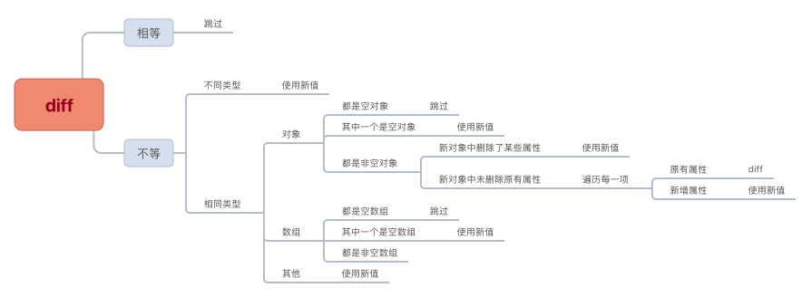

# redux-miniprogram-bindings


适用于小程序的 [Redux](https://github.com/reduxjs/redux) 绑定辅助库

## 特性

- API 简单灵活，只需一个 `connect` 即可轻松使用(提供 `$page` 和 `$component` 别名快捷方法)
- 功能完善，提供了多种使用方式，可满足不同的需求和使用场景
- 支持在 XML 中使用
- 执行 dispatch 后所有未销毁的页面(或组件)内部状态自动更新，视图自动队列批量更新渲染
- 自动进行 diff 优化和批量队列更新处理，性能优异
- 支持 `微信小程序` 和 `支付宝小程序`

## 安装

- 通过 `npm` 或 `yarn` 安装

  ```bash
  # npm
  $ npm install --save redux-miniprogram-bindings redux
  # yarn
  $ yarn add redux-miniprogram-bindings redux
  ```

- 也可以直接引入 `dist` 目录下对应的 `redux-miniprogram-bindings` 文件

- 需要单独引入 [redux](https://github.com/reduxjs/redux) 文件(这只是个绑定库，并不包含 redux 的代码在内)

## 使用

1. 创建 Redux 的 Store 实例

   ```js
   // store.js
   import { createStore, combineReducers } from 'redux'

   function counter(state = 0, action) {
     switch (action.type) {
       case 'INCREMENT':
         return state + (action.step || 1)
       case 'DECREMENT':
         return state - (action.step || 1)
       default:
         return state
     }
   }

   const initUserInfo = { name: 'userName', age: 25 }
   function userInfo(state = initUserInfo, action) {
     switch (action.type) {
       case 'SET_USER_INFO':
         return { ...state, ...action.userInfo }
       default:
         return state
     }
   }

   const rootReducer = combineReducers({ counter, userInfo })
   const store = createStore(rootReducer)

   export default store
   ```

2. 在 `app.js` 文件中设置 provider

   ```js
   // setupStore.js
   import store from 'your/store/path'
   // 微信小程序
   import { setProvider } from 'redux-miniprogram-bindings'
   // 支付宝小程序
   // import { setProvider } from 'redux-miniprogram-bindings/dist/redux-miniprogram-bindings.alipay.min.js'

   setProvider({ store })
   ```

   ```js
   // app.js
   // 确保在其他代码之前调用
   import './setupStore.js'

   App({
     /** ... */
   })
   ```

3. 在页面中使用

   ```js
   import { $page } from 'redux-miniprogram-bindings'
   import { actionCreator1, actionCreator2 } from 'your/store/action-creators/path'

   $page({
     mapState: ['dependent', 'state'],
     mapDispatch: {
       methodsName1: actionCreator1,
       methodsName2: actionCreator2,
     },
   })({
     onLoad() {
       // 读取 state 中的值
       const { dependent } = this.data
       // dispatch actionCreator1
       this.methodsName1()
       // dispatch actionCreator2
       this.methodsName2(/** ...args */)
     },
   })
   ```

4. 在组件中使用

   ```js
   import { $component } from 'redux-miniprogram-bindings'
   import { actionCreator1, actionCreator2 } from 'your/store/action-creators/path'

   $component({
     mapState: [
       (state) => ({
         data1: state.dependent,
         data2: state.state,
       }),
     ],
     mapDispatch: (dispatch) => ({
       methodsName1: () => dispatch(actionCreator1()),
       methodsName2: (...args) => dispatch(actionCreator2(...args)),
     }),
   })({
     attached() {
       // 读取 state 中的值
       const { data1: dependent } = this.data
       // dispatch actionCreator1
       this.methodsName1()
       // dispatch actionCreator2
       this.methodsName2(/** ...args */)
     },
   })
   ```

5. 在 XML 中使用

   ```html
   <view wx:if="{{ data1 }}">{{ data2 }}</view>
   ```

6. 详细用法请参考 [`API`](#API) 介绍和 [`示例`](https://github.com/DPFlying/redux-miniprogram-bindings/tree/master/example)

## API

### setProvider：`(config) => void`

设置 Provider

- config 对象的属性：

  - store：`Store`

    Redux 的 Store 实例对象，必传

  - namespace：`string`

    命名空间，默认为空

    当设置命名空间后，会将所有依赖的 state 数据存放到 `以命名空间字段值为 key` 的对象中，此时读取 state 值需要加上命名空间字段值

    > 例如设置 `namespace: '$store'`，那么在页面(或组件)中获取依赖的 state 值需要使用 `this.data.$store.xxx` 形式，在 XML 中也需要加上前缀：`<view>{{ $store.xxx }}</view>`

    > 命名空间存在的意义：
    >
    > - 明确哪些数据是来自于 store
    > - store 中的数据必须通过 dispatch 才能触发更新。命名空间可以避免无意中使用 `this.setData` 造成 store 中的数据被修改,因为需要加上额外的命名空间前缀：`this.setData({ '$store.xxx': xxx })`

  - component2: `boolean`

    是否开启了 component2，默认为 `false`，仅 `支付宝小程序` 支持

- 该函数必须在所有用到 `store` 的代码之前调用

  **最佳实践：**

  要保证 `setProvider` 在所有用到 `store` 的代码之前调用，但是代码中各处充斥着对 `store` 的使用，如何保证？

  可以单独新建一个 js 文件(例如 `setupStore.js`)用来调用 `setProvider`，然后在 `app.js` 文件最顶部引入该文件即可

  ```js
  // setupStore.js
  import store from 'your/store/path'
  // 微信小程序
  import { setProvider } from 'redux-miniprogram-bindings'

  setProvider({ store })
  ```

  ```js
  // app.js
  import './setupStore.js'

  App({})
  ```

### connect：`(config) => (options) => void | options`

连接 store

- config 对象的属性：

  - type：`"page" | "component"`

    所连接实例的类型，默认为 `page`，可选值：`page`、`component`

  - mapState：`(string | ((state: Object) => Object))[]`

    实例依赖的 state，可选

    会将依赖的 state 数据注入到 data 中，并在后续状态改变时自动更新。是个数组类型，数组中可以包含字符串、函数

    - 数组中的字符串：字符串为依赖的 state 的相应的 key 值，页面(或组件)会在依赖的 state 发生改变时自动更新状态和队列批量触发视图渲染

      ```js
      {
        // state1、state2 为 store 的 state 中的 key 值
        // store.getState().state1
        // store.getState().state2
        mapState: ['state1', 'state2']
      }
      ```

    - 数组中的函数：函数接收 state 作为参数，可通过 state 获取到最新的状态数据，该函数必须返回一个对象，对象中的每一项可以是任意值，一般是根据 state 组合的数据

      该方式会在 store 数据发生改变(并非一定是当前实例依赖的状态发生改变)时执行函数，然后对函数返回的结果和现有 data 中的数据进行 diff 比较，确认发生改变后队列批量更新渲染

      ```js
      {
        mapState: [
          (state) => ({
            region: state.province + state.city + state.area,
            name: state.userInfo.name,
          }),
        ]
      }
      ```

    - 字符串和函数混合：函数会在每次 store 数据发生改变时调用，请确保函数足够的小和快。出于性能优化，建议多使用字符串形式，减少使用函数形式，必要时将两种形式混合使用

      ```js
      {
        mapState: [
          'name',
          (state) => ({
            region: state.province + state.city + state.area,
          }),
        ]
      }
      ```

  - mapDispatch：`Object | dispatch => Object`

    注入可执行的 dispatch 处理函数，可选

    - 对象形式：`key` 值为自定义函数名，实例内部可以通过该名称访问该方法，`value` 值为 `actionCreator` 函数。会将 actionCreator 函数包装成自动调用 disptach 的函数，并注入到实例方法中

      ```js
      // 配置
      mapDispatch: {
        methodsName1: actionCreator1,
        methodsName2: actionCreator2,
      }

      // 调用
      this.methodsName1()
      // 相当于
      dispatch(actionCreator1())

      // 调用
      this.methodsName2(a, b, c)
      // 相当于
      dispatch(methodsName2(a, b, c))
      ```

    - 函数形式：函数接收 dispatch 作为参数，返回一个对象，包含自定义整理后的处理函数

      ```js
      // 配置
      mapDispatch: (dispatch) => ({
        methodsName1: () => dispatch(actionCreator1()),
        methodsName2: (...args) => dispatch(actionCreator2(...args)),
      })

      // 调用
      this.methodsName1()
      this.methodsName2(a, b, c)
      ```

    > **注意：** 通过 mapDispatch 注入的函数也可以在 XML 中作为事件处理函数使用。如果函数需要传递参数时请注意，事件处理函数默认会传入 `event` 对象作为函数的第一个参数

    ```html
    <view bind:tap="handleAdd">Add</view>
    ```

  - manual：`boolean`

    是否需要手动调用 `Page()` 或 `Component()`，默认值为 `false`

    当设置为 `true` 时，`connect` 会返回处理好的传入的 options 对象，需要手动调用 `Page()` 或 `Component()` 进行实例注册。这为使用者自定义扩展提供了途径

    ```js
    const options = connect({
      manual: true,
    })({
      // ...
    })

    options.xxx = 'xxx'

    Page(options)
    ```

- 扩展封装：可能你不喜欢 `connect` 的传参方式，或者不想使用前还要引用，那么可以自行扩展封装

  示例扩展 Page：

  ```js
  // bootstrap.js
  import { connect } from 'redux-miniprogram-bindings'

  const oldPage = Page

  Page = function (options) {
    const { mapState, mapDispatch, ...restOptions } = options

    const realOptions = connect({
      mapState,
      mapDispatch,
      // 此处必须设置为手动挂载，因为已经重写了 Page 函数
      manual: true,
    })(restOptions)

    oldPage(realOptions)
  }
  ```

  ```js
  // app.js
  // 引入扩展
  import './bootstrap.js'

  App({})
  ```

  ```js
  // 使用
  Page({
    mapState: [
      // ...
    ],
    mapDispatch: {
      // ...
    },
  })
  ```

### \$page

connect Page 的别名

```js
$page()({})
// 相当于
connect({ type: 'page' })({})
```

### \$component

connect Component 的别名

```js
$component()({})
// 相当于
connect({ type: 'component' })({})
```

### Utils

#### useStore: `() => Store`

获取 store 实例对象

```js
import { useStore } from 'redux-miniprogram-bindings'
const store = useStore()

// 相当于如下方式，但是支付宝小程序分包时不建议使用如下方式，会出现多 store 实例
import store from 'your/store/path'
```

#### useState: `() => Object`

获取当前 state 对象

```js
import { useState } from 'redux-miniprogram-bindings'
const state = useState()

// 相当于如下方式，但是支付宝小程序分包时不建议使用如下方式，会出现多 store 实例
import store from 'your/store/path'
const state = store.getState()
```

#### useDispatch: `() => Dispatch`

获取 dispatch 函数

```js
import { useDispatch } from 'redux-miniprogram-bindings'
const dispatch = useDispatch()

// 相当于如下方式，但是支付宝小程序分包时不建议使用如下方式，会出现多 store 实例
import store from 'your/store/path'
const dispatch = store.dispatch
```

#### useSubscribe

添加 store 订阅

接收一个回调函数，该函数会在 store 数据发生改变时调用，该函数接收两个参数，分别是当前状态 currState 和之前状态 prevState，通过对比两者数据实现细化监听

返回一个函数，调用该函数可以取消订阅

```js
import { useSubscribe } from 'redux-miniprogram-bindings'

$page()({
  onLoad() {
    // 启用订阅
    this.unsubscribe = useSubscribe((currState, prevState) => {
      if (currState.userInfo.name !== prevState.userInfo.name) {
        console.log('userName change')
      }
    })
  },

  onUnload() {
    // 解除订阅
    this.unsubscribe()
  },
})
```

#### useRef

获取 state 对象中数据的引用

接收一个 selector 函数，该函数接收 state 作为参数，可以返回任意值(建议返回使用 state 组装的数据)

返回一个 Ref 对象，该对象拥有一个只读的 value 属性，通过该属性可以得到 selector 函数返回的最新值

```js
import { useRef } from 'redux-miniprogram-bindings'
const selector = (state) => state.userInfo.name
const userNameRef = useRef(selector)

setInterval(() => {
  // 不管 state 数据是否发生改变，得到的永远是 state.userInfo.name 的最新值
  console.log(userNameRef.value)
}, 1000)
```

也可以通过如下方式实现相同功能

```js
import { useState } from 'redux-miniprogram-bindings'
const selector = (state) => state.userInfo.name
const getUserName = () => selector(useState())

setInterval(() => {
  // 不管 state 数据是否发生改变，得到的永远是 state.userInfo.name 的最新值
  console.log(getUserName())
}, 1000)
```

具体使用哪种方式完全看个人喜好，这里只是提供了一个工具方法

#### useSelector

对 selector 函数结果进行缓存

接收一个 selector 函数，该函数接收 state 作为参数，可以返回任意值(建议返回使用 state 组装的数据)

同时接受一个 deps 数组，该数组包含 selector 函数结果变更依赖的 state 的 key 值

返回一个同 selector 函数签名一致的函数，该函数每次执行时会对依赖项 deps 数组中每一项的值进行浅比较，只有依赖项的值发生改变时才会重新执行函数，降低复杂逻辑函数的执行频率

```js
// 配合 useRef 使用
import { useRef, useSelector } from 'redux-miniprogram-bindings'
// 只在 state.userInfo 发生改变时才会重新执行
const userNameselector = useSelector((state) => state.userInfo.name, ['userInfo'])
const userNameRef = useRef(userNameselector)

setInterval(() => {
  console.log(userNameRef.value)
}, 1000)
```

```js
// 配合 mapState 使用
import { $page, useSelector } from 'redux-miniprogram-bindings'
// 只在 state.userInfo 发生改变时才会重新执行
const userNameSelector = useSelector((state) => ({ userName: state.userInfo.name }), ['userInfo'])

$page({
  mapState: [userNameSelector],
})({})
```

## diff 逻辑


